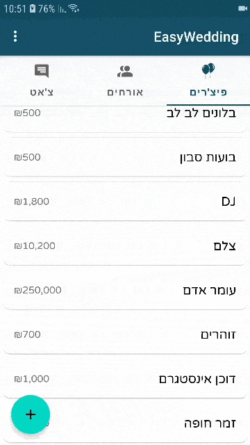

# EasyWedding

EasyWedding is an Android app that helps couples who are getting married to organize their wedding.

***Build is in progress.***

### Demos

#### Guests

#### Features

##### Chat

##### Share wedding's data (Ask for access and grant access)

##### Arrival confirmation (Web) and update in Android

##### AuthUI sign-in flow

### Features
  - Firebase AuthUI sign-in flow.
  - Multi-User Chat , for wedding content only.
    - Open a chat and invite others to join.
    - Supported languages are English and Hebrew.
    - Support in Url, Phone Number and Email parsing.
    
    ***Note: A user can be only in one chat.***

### Todos
- ##### Chat
   - Message confirmation.
   - Indication of when a user joins the chat or leaves the chat.
   - Sound feedback to actions.
   - Quotation.
   - Send/receive image and pdf.
   
### Database
 - Firebase Realtime Database 
     
License
----

MIT
